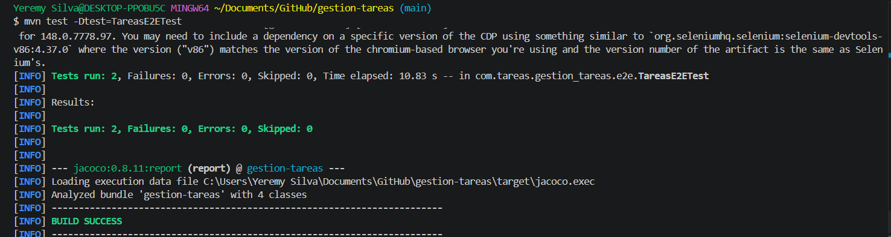
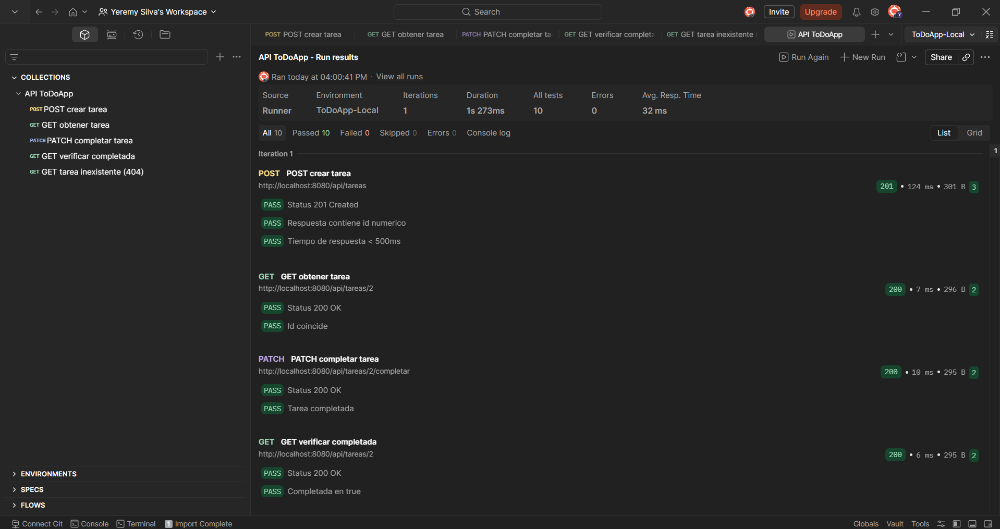
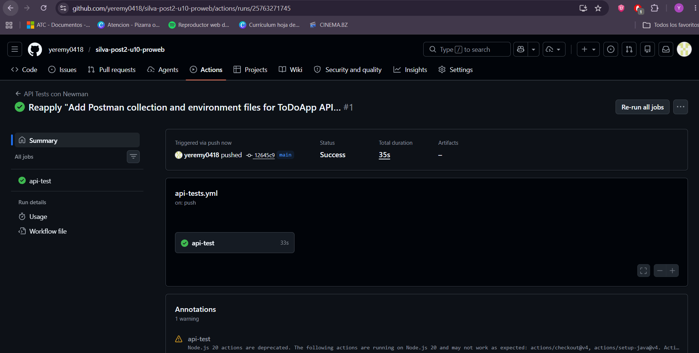

# Gestion de Tareas

Proyecto de ejemplo con API de tareas, pruebas E2E con Selenium y coleccion Postman
para validacion automatizada.

## Requisitos

- Java 17
- Maven 3.9+
- Google Chrome (para Selenium)
- Node.js 18+ (para Newman)

## Estructura del repositorio

- `postman/` coleccion y entornos
- `.github/workflows/` workflow de CI con Newman
- `src/test/java/com/tareas/gestion_tareas/e2e/` pruebas Selenium y Page Objects

## Ejecutar pruebas E2E (Selenium)

Modo headless:

```bash
./mvnw test -Dtest=TareasE2ETest
```

## Ejecutar Newman localmente

```bash
npm install -g newman
newman run postman/ColeccionToDo.json --environment postman/env-local.json
```

## GitHub Actions

El workflow que ejecuta Newman en CI esta en:

```bash
.github/workflows/api-tests.yml
```

## Evidencias

- Evidencia 1 (Selenium en verde):



- Evidencia 2 (Postman Runner 0 failures):



- Evidencia 3 (GitHub Actions passing):


